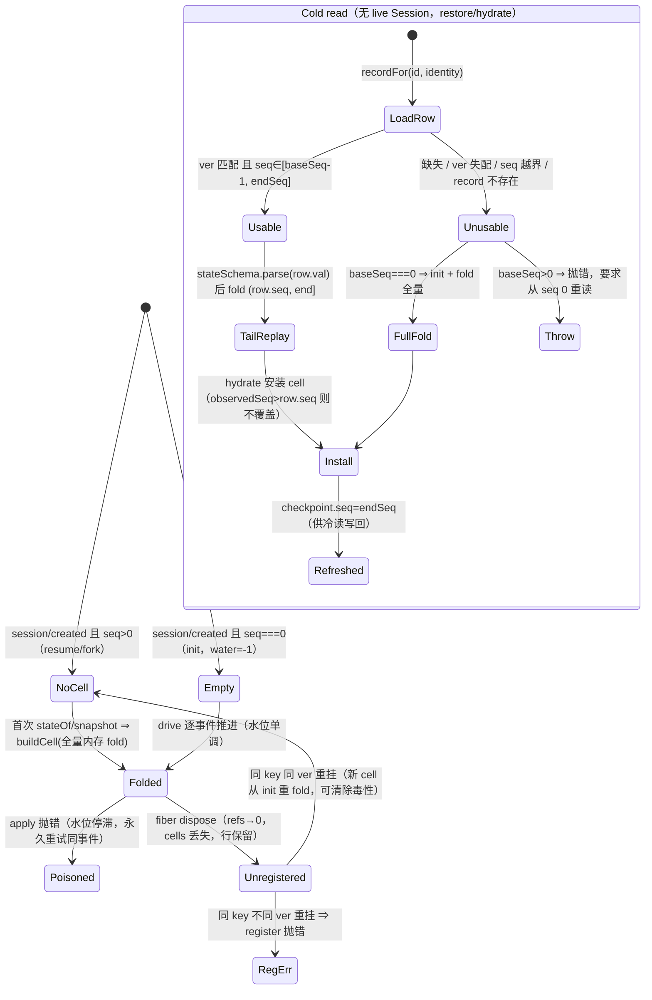

# DSH Session projection 与 projection-cache：注册、fold、checkpoint、恢复与一致性

> 状态：基于 DSH 源码静态核验（只读）。DSH 根：`C:\Users\chuxi\Documents\trae_projects\code\deepseek-harness`
> 限定范围：`packages/session/session-projection/**`、`packages/session/session-projection-cache/**`，加 Session restore/事件派发与 goal/todo 消费者最小一层。
> 不重复 00/03/04/06 已证实内容（append-only 日志、surface、JSONL backend、write-behind 200ms、无跨进程锁等）。
> 证据标记：【已证实】=已读源码含行号；【待深挖】=机制已见但未完整核验；【未找到】=限定范围内不存在。
> 行号格式：`路径:行`（省略 `packages/` 前缀）。
> 核心问题：projection 能否作为**派生状态恢复设施**——下节先给判定，其余为题 1–9 的证据。

---

## 0. 判定摘要（能否作为派生状态恢复设施）

**可以，且带三条硬边界。**

- 它能保证的：**由 Session 事件驱动、纯函数 fold、状态为 plain JSON** 的派生状态，在重启/重开会话后恢复出与在线 fold 逐位一致的值；恢复后 `seq` 水位（`observedSeq`）诚实，不产生"幻影值"（cache 行绝不超前于 *durable* 日志）。
- 它**不提供**的：定义无关的失效、增量事件 notify 恢复、跨进程一致、以及"无事件的状态变化"（如 goal 的 activation）——后者必丢。
- **关键落差（本条最可能影响落地方案）**：缓存加速的"恢复"实际只在**观察路径**（`sessionQuery.observeSession`）发生；`agentLoop.resume` 这条**在线恢复路径永远从空单元格开始，首次读取在内存里全量 fold 整个日志**（见 Q3）。因此"恢复成本"不是一个数，而是两条路径的两个数。

---

## 1. 契约与生命周期：definition / registry / stateOf

### 1.1 Definition 契约（`session/session-projection/src/index.ts:48-93`）

| 字段 | 契约 | 行号 |
|---|---|---|
| `key` | 该 unit 独占的 projection key（`SessionProjectionStateMap` 条目） | :53 |
| `stateSchema: ZodType<S>` | **持久态在播种 fold 之前**先校验 | :55 |
| `init(header, inheritedEventCount)` | 空日志状态；`inheritedEventCount` = 精确 fork 继承前缀长度 | :62 |
| `apply(state, event)` | 纯函数、**同步**、无关事件必须返回**同一引用**（`Object.is` 相等 ⇒ 零下游工作） | :64-71 |
| `wire?{viewSchema, view}` | 可选；有则进入 client snapshot/changed feed | :73-85 |
| `stateVersion` | 非负安全整数；序列化字段或 fold 语义变化即须 +1 | :92, :270-272 |

- 【已证实】**同步是硬约束**："an async unit would tear the carriers' consistency cut"（`:44-46`）；`state` 必须 plain JSON（"the persisted-cache precondition"，`:46`）。
- 【已证实】类型规则：`ErasedDefinition` 做类型擦除以驱动（`:139-147`）；`stateVersion` 非法（负数/非整数）在 `register` 时抛（`:270-272`）。

### 1.2 注册：引用计数 + fiber effect

- 【已证实】`register()` 把注册体做成 `ctx.effect`，disposer 挂调用方 fiber（`:273-292`）。同 key 再注册：`stateVersion` 不一致**直接抛**（`:279-281`），一致则 `refs += 1`（`:282`）；最后一个 disposer 才 `registrations.delete(key)`（`:284-290`）。`refs` 存在的原因：同一 tool package 被 N 个 agent preset 挂载会注册 N 次（`:158-168`）。
- 【已证实】`Registration = { def, cells: WeakMap<Session, UnitCell>, refs }`（`:169-174`）；cells 按 **Session 对象**为键，不是按 id。

### 1.3 Cell 与水位

- 【已证实】`UnitCell = { state, observedSeq, views: [prev, cur] }`（`:149-156`）。`observedSeq` 语义是"**已经过 `apply` 的最后一个事件 seq**（不论是否变引用）"（`:152-153`），空日志为 `-1`。

### 1.4 stateOf 与其它读面

- 【已证实】`stateOf(session,key)`：key 未注册返回 `undefined`（`:319-327`），否则 `materializeCells(session)` 后返回**活引用**（文档明确 "callers must not mutate it"，`:312-318`）。
- 【已证实】`snapshot(session,keys?)`：全同步单一读切，`asOfSeq = cursorBefore(session.seq)`（`:351`）；值经 `viewSchema.parse` 才出宿主（`:704-708`）。
- 【已证实】`cachedSnapshot(session,keys?)`：**不 fold**，只读已有 cell（`:354-380`），值是 hint 不是 baseline；`asOfSeq` 取**最低** `observedSeq`（`:375-377`）。
- 【已证实】`checkpoint(session)`：对**每个**注册 key 产出 `{ver, seq, val}`，`val` 是 `structuredClone`（**分离副本**，防止调用方污染活 cell）（`:396-407`）。
- 【已证实】`onChanged(listener)`：仅当 unit 有 `wire` 且 `view` 结果 `Object.is` 变化才通知，`seq` = 触发变化的事件 seq（`:100-105, :686-693`）。

---

## 2. append 时 fold 的同步顺序、失败与隔离

### 2.1 顺序（全部同步，且发生在 append 提交边界内）

- 【已证实】`Session.append`：`validateNext` → **先收集 callbacks** → `log.push(event)` → 派发（`core/session/src/index.ts:698-711`；`:705` 收集、`:707` push、`:710` 派发）。因此 registry 的 listener 被调用时**事件已在 log 内**。
- 【已证实】`SessionProjectionRegistry` 构造时 `ctx.on('session/event', (s,e) => this.drive(s,e))`（`session-projection/src/index.ts:220-222`）。
- 【已证实】`drive()` 逐 registration（`:655-701`）：
  1. 有 cell 且 `observedSeq >= event.seq` ⇒ **跳过**（幂等保护，`:658`）；
  2. 无 cell ⇒ `buildCell(init 后 fold [0, event.seq) 前缀)`——前缀切片精确，因为 `seq == log 下标`（`:659-668`）；
  3. 有 cell 且落后 ⇒ `advanceCell` 补齐到 `event.seq - 1`（`:669-676`）；
  4. `apply(state, event)`；`changed = !Object.is(next, prev)`；写回 `cell.state`、`cell.observedSeq = event.seq`（`:677-681`）；
  5. `changed && wire` ⇒ 维护 `views[0..1]`，仅在有监听者时计算 view；`views[1] = view(next)`，与 `views[0]` 不同才 `viewSchema.parse` 并通知（`:682-697`）。

### 2.2 失败与隔离

- 【已证实】`session/event` 是**包含式**派发（每 listener 单独 try/catch，仅 warn）⇒ **`apply` 抛错不会使 `append` 失败，也不会饿死后续 listener**（结论依据 `core/session/src/index.ts:638-639` 的契约 + `invokeContainedSessionObservers`；本层源码即 `session-projection` 未捕获）。
- 【已证实】**但失败不是良性的**：`drive` 中 `apply` 抛错发生在 `cell.state`/`observedSeq` 赋值**之前**（`:677-681`），于是该 cell 的水位**停在失败事件之前**。此后任何读取都经 `advanceCell` 从同一 seq 重放（`:632-652`）⇒ **同一事件再次抛错，该 key 永久不可读**（同一进程内）。注册表**没有** failure 墓碑机制。
- 【已证实】正确做法由消费者自己实现：`goal` 在 fold 内 catch 并把错误写进状态 `failure`，`state()` 读时才 throw（`goal/goal/src/index.ts:146-159, :474-479`）；源码注释明写"without throwing from the projection registry's event drive"（`:137-141`）。
- 【已证实】wire 侧两处也会抛并同样逃出 `drive`：`wire.view(next)`（`:687`）与 `wire.viewSchema.parse`（`:689`）。
- 【未找到】registry 层的 per-unit 异常隔离、失败重试或跳过机制。

---

## 3. 首次访问 / restore / 已有 session 的全量 fold 路径（**本题含关键落差**）

三条独立路径：

**A. 新会话（`seq === 0`）** — 【已证实】`session/created` 时若 `session.seq === 0`，为每个 registration **预建** cell（`init`，`observedSeq = -1`）（`:209-219`）。

**B. 恢复/fork 的会话（`seq > 0`）** — 【已证实】同一 listener 首行 `if (session.seq !== 0) return`（`:210`）⇒ **不建 cell**。所以恢复后的 cell 是**惰性**的：
- `cellFor` 无 cell ⇒ `buildCell(def, header, inheritedEventCount, session.snapshotEvents())`，即 **`init` 后全量 fold 内存中整个日志**（`:614-629`）；
- fork 也是这条（fork 的 child `seq = seed.length + 1 ≥ 1`，`core/session/src/index.ts:1145-1160`；`prepare()` 对 seed 追加 `session/end-seed`，`:575-577`）。
- 【已证实】**因此 `agentLoop.resume` 这条在线恢复路径不经过 projection cache**：`resumeWith` → `persistence.prepare(id)`（`core/agent-loop/src/index.ts:748-753`）→ coordinator `prepare` → `prepareCore` → `sessions.prepare(id,{seed,meta,seedSource:'persistence'})`（`session/session-persistence/src/coordinator.ts:1082-1087`）→ `Session.fromRestore`（`core/session/src/index.ts:505-511`）→ `setupAndPublish` 发布（`agent-loop/src/index.ts:759-767, :619-633`）。这条链上**没有任何** `hydrate`/`hydratePrepared` 调用；发布时 `session/created` 因 `seq > 0` 被 registry 跳过。
- 【已证实】**投影缓存的加速只在观察路径生效**：`sessionQuery.observeSession` → `SessionObservationReader.read` 的 cold 分支 → `cache.hydratePrepared(prepared, events)`（`session-query/session-query/src/observation.ts:188-199, :115-121, :195-198`）。
- 【已证实】**并且该加速在 API 冷恢复里被丢弃**：`session-controller` 的 `resume()` 先 `observeSession` 取得已 hydrate 的 prepared session（`api/session-controller/src/agent.ts:398-402`），`resumeObserved` **只使用** `observation.header`(id/cwd) 与 `observation.projections.values.agentPreset`（`:412-432, :500-508`），随后独立调用 `ctx.agents.resume`，后者在**另一个** Session 实例上重新 `persistence.prepare`（`:428-433`）。⇒ hydrate 结果不随实例迁移。
  - ⚠️ 与 `04-Goal与Todo长期状态.md:91` "重启时由 `SessionProjectionCache.hydratePrepared()` …恢复" 的说法**不完整**：`hydratePrepared` 的作用面是观察/列表读，不是 agent 在线恢复。该处应更正。

**C. 冷读（无 live Session）** — 【已证实】`restore(checkpoint, events, baseSeq, header, inheritedEventCount)`（`session-projection/src/index.ts:495-540`）逐 key：
- `usable = row 存在 && row.ver === def.stateVersion && row.seq >= baseSeq-1 && row.seq <= endSeq`（`:510-513`）；
- 不可用且 `baseSeq > 0` ⇒ **抛错**要求调用方从 seq 0 重读（`:514-519`）；
- 可用 ⇒ `stateSchema.parse(row.val)` 播种，`from = row.seq`，从 `startIndex = from - baseSeq + 1` 起前向 replay（`:520-532`）；
- 逐事件断言 `event.seq === baseSeq + index`，缺号即抛（`:527-530`）；
- 返回 `{snapshot, checkpoint}`，新 checkpoint 的 `seq` 一律 = `endSeq`（`:534, :536-539`）。
- 【已证实】`restoreFloor(checkpoint)`：任一 key 行缺失或 `ver` 不匹配 ⇒ 该 key 需 `0`，floor 取所有 key 的**最小值再减 1**（"one-below anchor"，`:425-435`）；无注册 unit 返回 `undefined`（`:434`）。该 anchor 的用途：尾部读空 ⇒ end 低于所有水位 ⇒ `restore` 拒绝 ⇒ 全量重读（`:409-424`）。

---

## 4. cache 的 key / version / seq / value 格式与 checkpoint 写入时机

### 4.1 形状

- 【已证实】domain `session_projcache`：`version: 5`，`compatibleVersions: [3,4]`，`invalidRecords: 'backup-and-skip'`，`layout: 'per-record'`，表 `sessions`（`session-projection-cache/src/spec.ts:94-101`）。
- 【已证实】存储键 = **SessionId**；行结构 `checkpointRow = { ver: int≥0, seq: int≥-1(→SessionSeqCursor), val: z.json() }`（`spec.ts:26-31`）——即 RFC 的 `(sessionId, key, ver, seq, val)` 去掉两个 record key（`:18-25`）。
- 【已证实】record = `{ identity, rows: Record<key, checkpointRow> }`，**每次写入整条替换**（whole-value discipline，`spec.ts:59-68`）。
- 【已证实】identity = `{ createdAt, cwd?, isSeeded?, inheritedEventCount? }`（`spec.ts:49-54`）；读取比对 `identityMatches`：四个字段全等，缺失的 `isSeeded/inheritedEventCount` 按未播种分支解释（`src/index.ts:370-382`）。`identityOf` 拒绝"未播种却有继承计数"（`:353-368`）。
- 【已证实】物理落点（文档，非本层代码）：`<root>/session_projcache/sessions/<id>.json`，root = `dshHomePath('storages')`（`README.md:12, :38`；`bundle/base/cordis.patch.yml:148-151`）。
- 【未证实】**行内没有任何"日志长度/文件 revision"字段**。`viewCheckpoint` 只校验 `row.ver` 与 schema（`session-projection/src/index.ts:448-469`），不比对存储日志尾部 ⇒ cache 无法独立发现"外部追加"或"日志被截断"；这正是 `README.md:61` 要求"seeded 的 header-only listing 必须跳过此快路径"的原因。

### 4.2 写入时机

- 【已证实】配置：`writeEveryEvents`、`writeIntervalMs` 均 required（`src/index.ts:55-65`）；基础 bundle 取 **200 / 5000ms**（`bundle/base/cordis.patch.yml:162-166`）。
- 【已证实】三个**强制点**（`src/index.ts:260-311`）：
  - `session/created` ⇒ `flushSoft('create')`（`:286-288`）；
  - 事件为 `turn/end` ⇒ `flushSoft('turn/end')`（`:264-267`）；
  - `session/disposed` ⇒ `flushSoft('detach')` + `markClean` + `dirty.delete`（`:294-298`）。
  - 其余事件：`pending += 1`；`pending >= writeEveryEvents` ⇒ 立即 flush；否则 `timer ??= setTimeout(writeIntervalMs)`（`:268-279`；注意 `??=` ⇒ 定时器自首个 dirty 事件起算，非滑动窗口）。
- 【已证实】`write(session)`（`:205-221`）的精确次序：
  1. `rows = ctx.sessionProjections.checkpoint(session)`（**先取切面**，`:206`）；
  2. `markClean(session)`（`:207`，清 pending 与 timer）；
  3. `if (ctx.sessions.get(session.id) === session) await ctx.sessions.flush(session)`（**durability barrier**，`:215`）；
  4. `put(id, identity, rows)`（`:216-220`）⇒ `snapshotJsonValue(rows)`，`undefined` 即抛 `TypeError`（"violates the plain-JSON contract"，`:338-344`）。
- 【已证实】`flushSoft` 包住 `write`，失败只 warn（cache 保持 stale）（`:318-324`）；`coldSnapshot` 的写回是 fire-and-forget + fail-soft（`:251-253`）。
- 【已证实的跨层结论】第 4 步 `KvTable.put` 的**耐久与原子性**由 storage 层提供（本轮限定排除其内部，直接引用同批调查 `07-DSH存储域生命周期与并发.md`）：domain 写链固定"**先落盘、再改内存**"（`07` Q2/Q3），`writeAtomic` = 临时文件 + 文件 fsync + 原子 rename + 目录 fsync（`07` Q4），且契约要求"`put` resolve ⇒ 崩溃后 reopen 必能看到该写"（`07` 决策事实 7：写 resolve 即耐久，无独立 flush 端口）。
  ⇒ 对本层的影响：`write()` 的 `put` await 返回 **即代表 cache 行已耐久**，所以 §6 崩溃窗口 2 只覆盖"`put` 尚未开始或被拒"的区间，而不是"已写但未刷盘"的区间。

---

## 5. 命中后的 tail replay、ver/seq 越界、损坏与 stale

| 情形 | 行为 | 证据 |
|---|---|---|
| 命中且 `ver` 匹配 | 旧前缀**跳过 `apply`**（从 `row.seq` 之后前进），并刷新 checkpoint 的 `seq = endSeq` | `session-projection/src/index.ts:520-534` |
| `ver` 不匹配 | 丢弃该行，改 `init` 全量 refold；`baseSeq > 0` 时**抛错**要求从 0 重读 | `:510-519` |
| `seq` 越界（`row.seq > endSeq`，即日志被截断/回退） | 行不可用 ⇒ 同上（丢弃或抛） | `:512-519`；`restoreFloor` 的 one-below anchor 专门用于暴露此情形 `:409-424` |
| `seq` 早于 baseSeq | 行不可用（`row.seq >= baseSeq-1`，即只容忍"刚好前一格"） | `:512` |
| `stateSchema.parse` 失败 | `hydrate` 路径由调用方 catch 后**以空 checkpoint 全量重放**（`src/index.ts:182-193`）；`viewCheckpoint` 路径直接 `continue` 跳过该 key（`:460-465`） |  |
| 事件缺号 | `restore`/`advanceCell` 抛 "cannot restore/advance across missing seq" | `:527-530, :640-643` |
| record schema 校验失败（磁盘） | domain `invalidRecords: 'backup-and-skip'` ⇒ 文档改名 `<key>.json.bak.<stamp>`、记录具体错误、该会话按"无缓存"服务（下次冷读重建） | `spec.ts:86-93` |
| identity 不匹配（同 id 不同生命周期） | `recordFor` 返回 `undefined`，整条 record 视作不存在 | `src/index.ts:104-120, :370-382` |
| 无缓存记录 | `hydratePrepared` 走 `hydrate(session, {}, events, 0)` 全量 fold | `:179-181` |
| 版本迁移 | `compatibleVersions [3,4]` 读兼容；旧 record 缺 lineage 字段时按未播种解释，播种调用方必然不匹配 ⇒ 冷重建 | `spec.ts:73-87`；`src/index.ts:370-382` |

- 【已证实】`hydrate` 的**快捷出口**：若**所有**注册 unit 的 cell 都已 `observedSeq === endSeq`，直接返回，不查 checkpoint（`session-projection/src/index.ts:558-575`）。
- 【已证实】安装 cell 时的**防回退保护**：`current !== undefined && current.observedSeq > row.seq` ⇒ 跳过，不覆盖更新的 cell（`:586-587`）。

---

## 6. 与 Session JSONL 的原子一致性边界与崩溃窗口

- 【已证实】**唯一显式的排序承诺**："log leads, the cache follows"。`write()` 先取 checkpoint 切面、再 `flush(session)`（fsync 屏障）、最后 `put`（`src/index.ts:205-221`；`README.md:65`）。
- 【已证实】**存在反序窗口，机理如下**（且"幻影值"不会跨 *durable* 日志出现，但可超前于 *flushed* 日志）：
  1. `checkpoint(session)` 会 `cellFor` 惰性建 cell ⇒ 对恢复中的 session，**先做一次内存全量 fold**（`:396-407 → :614-629`）。
  2. registry 的 `drive` 是 `append` 内的**同步** listener，`Session.append` 是同步的 ⇒ 任何 `append` 返回后，cell 必然已包含该事件。因此 `checkpoint` 的 `rows.seq` 只可能**小于** `session.seq`（滞后），不可能大于它。
  3. 所以 cache 行**不可能描述未进入内存日志的事件**；`flush` 只保证"切面之内的日志落盘"，超前只可能是"事件在内存但未 fsync"。⇒ 崩溃后 cache 至多与日志等长，也就是**永不产生幻影值**，只会 stale。
- 【已证实】**崩溃窗口 1（JSONL 侧）**：write-behind 缓冲（最长 200ms）内的事件彻底丢失（03 已证实）。若某次 `write()` 的 `flush` 与 `put` 都已完成，则崩溃丢失的是"之后 200ms 内的事件"——cache 停在 `rows.seq`，冷读时按 tail replay 补齐。
- 【已证实】**崩溃窗口 2（cache 侧）**：`put` 失败或未及写入 ⇒ cache 落后；`flushSoft` 只 warn，**自愈点是下一个强制点或下一次触发**。
- 【已证实，易被误读为 bug 的细节】`write()` 中 `markClean` 在 `flush` **之前**（`:207` vs `:215`）。若随后 `flush` 或 `put` 抛错，pending 与 timer 已被清零且**不会重建**（`:327-335`）⇒ 该 session 的"计数"和"间隔"两个节流触发点都被取消，只剩 `turn/end` / detach / 下次新 append（新 append 会重建 pending 与 timer，因为 `dirty.get` 为空会新建 state）。**结论：自愈需要后续事件流，静默会话不会自愈。**
- 【已证实】**两个存储是一致但非原子的两份介质**：日志在 `$DSH_HOME/sessions/**.jsonl[.zstd]`，cache 在 `$DSH_HOME/storages/session_projcache/sessions/<id>.json`（`07` Q7），无共享事务、无跨文件提交点。二者的关联只有"写序"（log 先）与"identity + 水位"（读时校验），没有任何事务或日志长度戳把它们绑在一起。
- 【未找到】任何 cache↔log 的校验和、日志长度戳、写入代际号或 repair 联动（`commitRepair` 截断日志后**不**通知 projection cache；下一次冷读靠 `restoreFloor` 的 anchor 才发现）。

---

## 7. 多实例与外部修改可见性

- 【已证实】**同进程**：cells 以 Session **对象**为键（`WeakMap`，`:171`）⇒ 同一 id 的两个 Session 实例各有独立 cell；`viewCheckpoint`/`checkpoint` 只描述各自实例。`.dsh` 侧无跨实例失效通知。
- 【已证实】**缓存不感知外部追加**：`cachedSnapshot(meta, inheritedEventCount)` 只做 identity + `ver` + wire schema 校验（`src/index.ts:137-160, :448-469`）⇒ 另一进程追加后，本进程仍会返回**旧水位**的值（值本身正确、只是陈旧，`asOfSeq` 诚实低估）。这依赖 `higher-seq-wins` 消费侧规则才安全（`src/index.ts:122-160`）。
- 【已证实】**同 id 不同生命周期被挡住**：`createdAt`/`cwd`/`isSeeded`/`inheritedEventCount` 四项身份（`src/index.ts:104-120`）⇒ 删除重建的同名 id、或在活的 cache 下换 storage root，都不会拿旧记录播种。
- 【已证实】**进程内"外部改写"可被发现**：走 `persistence.prepare`/`borrowSession` 的路径用 `readStoredRevision`（stat 的 dev/ino/size/mtime/ctime）比对，不符即 `discardReady` 重读（`session/session-persistence/src/coordinator.ts:1144-1150`；03 已证实的 :811-866）。
- 【已证实】**跨进程写同一 cache 记录**：两个 DSH 实例各自持有域内存表并各自整条替换同一 `<id>.json` ⇒ **last-writer-wins**，互为丢失；但因两侧都满足 identity 与行水位语义，读到的是"某一方的正确但可能更旧的 cut"，不是错值。DSH 无跨进程锁、无 `fs.watch`（03 已证实）。
- 【未找到】projection cache 层的任何实例标识、owner 字段、租约或冲突检测。

---

## 8. 定义 reload / 卸载后的 cell 行为

- 【已证实】**卸载**：disposer 只减 `refs`，归零才删 registration（`:284-290`）。被删后：`stateOf` 返回 `undefined`（`:323-324`）；`snapshot`/`cachedSnapshot`/`viewCheckpoint` 不含该 key（`:345-350, :369-374, :454-459`）⇒ 客户端读作"能力不存在"（`:186-197` 文档语）。
- 【已证实】**卸载不删除已持久化的行**：cache 记录按 sessionId 整条存储，与注册表无关（`session-projection-cache/src/index.ts:337-344`）⇒ key 消失期间记录保留，重挂后可直接复用（若 `stateVersion` 未变）。
- 【已证实】**重挂**：新 registration 带**空 `WeakMap`**（`:277`）⇒ 活 session 的 cell 不存在：
  - 下一个 `session/event` ⇒ `drive` 走 `cell === undefined` 分支，从 seq 0 折叠前缀再前送（`:659-668`）⇒ 与从未卸载等价；
  - 下一次读取 ⇒ `cellFor` 全量 fold（`:614-624`）。
- 【已证实】**同 key 换 `stateVersion` 重挂会抛错并挂载失败**（`:279-281`）⇒ 插件无法在运行期就地升级一个已注册 key 的版本；必须"卸载→（旧行自然失配）→以新版本重挂"，但那需要 refs 归零，同 fiber 内做不到。
- 【已证实】卸载时**在飞的 waterfall 链不受影响**（06 已证实 Cordis 语义）；对本层而言无 waterfall，但 `drive` 是同步的，因此不存在"半途换注册表"的窗口。
- 【未找到】任何针对 reload 的 cell 迁移/持久化交接。

---

## 9. 自定义长期状态投影：能保证 / 不能保证

### 9.1 可以保证（有实现证据）

1. 【已证实】**事件驱动确定性**：cell 只被 `session/event` 与 `eventAt`/`snapshotEvents` 驱动，按 log 顺序逐事件；`observedSeq` 水位保证不漏事件（`session-projection/src/index.ts:632-701`）。
2. 【已证实】**仅由事件决定的状态可跨重启恢复**：三类路径（cache 行播种 / 全量 fold / hydrate）最终都收敛到同一 fold 结果；`baseSeq>0` 时若行不可用会**显式抛错**而不是静默给错值（`:495-540`）。
3. 【已证实】**自动持久化**：注册即被 `checkpoint()` 纳入每条 record，含 host-only unit（无 `wire` 也会被 checkpoint，注释明写 `:242-243`；`:396-407`）。
4. 【已证实】**版本漂移是"丢弃"而非"迁移"**：`ver` 失配 ⇒ 冷重建，语义上不会把旧态前向折叠成垃圾（`:429-430, :510-513`；`spec.ts:18-25`）。
5. 【已证实】**崩溃安全方向是单调的**：cache 永不超过 durable 日志的 *一致切面*（§6）。
6. 【已证实】**可选 client 可见性**：`wire` ⇒ 进入 `snapshot`/`cachedSnapshot`/`viewCheckpoint` 与变更 feed（`:100-105, :338-352, :448-469`）。
7. 【已证实】**0 I/O 列表读**：冷会话可用 header 从 cache 直接出值（session-controller `list.ts:327-351`；`session-projection-cache/src/index.ts:137-160`）。

### 9.2 不能保证（列为落地约束）

1. 【已证实】**无事件驱动的状态必丢**：如 goal 的 `activation`（`goal/goal/src/index.ts:183-190` 为进程内 `runtimeStates`，`:481-491` 初值 `disarmed`）。重启后必须外部重新 arm（04 已证实）。
2. 【已证实】**恢复速度不保证**：在线 `resume` 路径首次读取 = 内存全量 fold（§3 B）。若把大状态投影挂在在线会话上，成本与日志长度线性相关，cache 不参与。
3. 【已证实】**`apply` 抛错即该 key 在本进程内永久不可读**（§2.2），除非 unit 自己吞并落地 failure 状态。
4. 【已证实】**`state` 必须是 plain JSON**：写入时 `snapshotJsonValue === undefined` ⇒ `TypeError`（`session-projection-cache/src/index.ts:338-344`），`spec.ts:26-31` 的 `z.json()` 再验一次。`Set`/`Map`/`Date`/类实例不可用；`goal` 为此做了 `Set ⇄ string[]` 转换（`goal/goal/src/index.ts:103-135`）。
5. 【已证实】**引用恒等是语义的一部分**：无关事件必须返回同一引用，否则 (a) `Object.is` 判定为变化 ⇒ 每次事件都触发 view 计算与通知（`:677-697`），(b) `hydrate` 的 `complete` 判定与水位语义不受影响但下游无用功放大。
6. 【已证实】**不能依赖跨进程一致或外部修改可见性**（§7）。
7. 【已证实】**不能在运行期改 `stateVersion`**（§8）。
8. 【已证实】**cache 持久化本身是 fail-soft**：任何一次写失败只 warn；`write()` 的 `markClean` 早于 `flush`（§6）⇒ 静默会话不会自愈。
9. 【已证实·跨层】cache 行**介质级耐久性有保证**：domain 写链"先落盘后改内存" + `writeAtomic`（临时文件→fsync→rename→目录 fsync）；`await put` 返回即耐久。例外是 **Windows 掉电**下的目录项持久性（无 `MOVEFILE_WRITE_THROUGH`）与**多进程整文档 LWW**（`07` Q4/Q5）。

---

## 附 A：时序图

```mermaid
sequenceDiagram
  autonumber
  participant C as Agent/Session 调用方
  participant S as Session (core/session)
  participant R as SessionProjectionRegistry
  participant U as Unit.apply / view
  participant PC as SessionProjectionCache
  participant D as storage-domain (session_projcache)

  Note over S,R: 新会话 seq===0
  S->>R: session/created(seq===0)
  R->>U: init(header, inheritedEventCount)  → cell{state, water=-1}

  Note over C,D: 每次 append（同步、无 await）
  C->>S: append(type,data)
  S->>S: validateNext → log.push(event)  (callbacks 先收集)
  S->>R: session/event(session,event)
  R->>R: cell 缺失? → buildCell(fold [0,event.seq))
  R->>U: apply(state,event)
  U-->>R: next（无关事件必须同引用）
  R->>R: observedSeq = event.seq
  alt changed && wire && listeners>0
    R->>U: view(next) → viewSchema.parse
    R->>R: views=[prev,cur]; 不同则 notify(session,key,value,seq)
  end
  opt apply/view 抛错
    R--xS: 异常被 session/event 包含式派发吞掉（仅 warn）
    Note over R: cell 水位停在失败事件前 ⇒ 该 key 之后永久不可读
  end
  S->>PC: session/event 监听（同一同步边界）
  alt event.type === 'turn/end'
    PC->>PC: flushSoft('turn/end')
  else pending >= writeEveryEvents
    PC->>PC: flushSoft('count')
  else
    PC->>PC: pending+=1; timer ??= setTimeout(writeIntervalMs)
  end

  Note over PC,D: 一次 write（可能由 turn/end / create / detach / 计数 / 定时器触发）
  PC->>R: checkpoint(session) → rows{key→{ver,seq,val}}
  Note over R: 惰性 cell 会在此处全量 fold（恢复会话的首次读成本）
  PC->>PC: markClean（清 pending+timer，先于 flush）
  PC->>S: sessions.flush(session)  ← durability barrier（日志先落盘）
  PC->>D: put(sessionId, identity, rows)（整条替换，fail-soft）
  Note over PC,D: 日志领先、cache 跟随 ⇒ 崩溃只会让 cache 落后，不会超前
```



---

## 附 B：可用于落地决策的事实

1. projection 只服务于**事件驱动的纯 fold**状态；`state` 必须 plain JSON，`apply`/`view` 必须同步且无关事件返回同引用（`session-projection/src/index.ts:44-92`）。
2. 恢复有**两条成本不同的路径**：观察路径（`observeSession` → `hydratePrepared`，cache 加速）与在线 resume 路径（`agentLoop.resume` → 惰性全量内存 fold，cache 不参与）。落地若关心恢复成本，必须按路径分别评估（`observation.ts:188-199`；`agent-loop/src/index.ts:748-753, :619-633`）。
3. 三个强制 checkpoint 点（create / `turn/end` / dispose）+ 计数 200 + 间隔 5000ms（`bundle/base/cordis.patch.yml:162-166`）；`turn/end` 是"列表读想要的"那个点（`session-projection-cache/src/index.ts:262-267`）。
4. cache 行在介质里**不含日志长度或 revision**，因此它只能被"信任为陈旧但正确"，不能自证与当前日志同步；消费方必须接受"低估 `asOfSeq`"（`:448-469`；`README.md:61`）。
5. 一致性方向是单向的且写序有明确代码点：`checkpoint` → `markClean` → `sessions.flush` → `put`（`:205-221`）。
6. `restoreFloor` 的 one-below anchor 是"日志收缩（crash repair 截断）"的探测器；`restore` 在 `baseSeq>0` 且行不可用时**抛错而非猜**（`:409-424, :510-519`）。
7. `stateVersion` 是"丢弃式失效"：全局一致、无迁移、注册期强校验同 key 版本一致（`:92, :279-281, :429-430`）。
8. 卸载/重挂是安全的且行保留，但**不能在运行期升版本**（§8）。
9. 同 id 不同生命周期的串味由 4 项 identity 阻断（`src/index.ts:104-120, :353-382`）。
10. `apply` 的错误语义是"进程内永久毒化该 key"；平台不代管失败态，unit 必须自带 failure 状态（`goal/goal/src/index.ts:146-159` 是可复用范式）。
11. `put` 的耐久性是**跨层事实**（引 `07`）：domain "先落盘后改内存" + `writeAtomic`（临时文件→文件 fsync→原子 rename→目录 fsync）⇒ 本层 `await put` 返回即已耐久，故 §6 崩溃窗口 2 只覆盖"`put` 未开始/被拒"的区间。**但 Windows 上 rename 无 `MOVEFILE_WRITE_THROUGH` 且目录 fsync 被跳过**，掉电场景的目录项耐久性不保证（`07` Q4）；多进程写同一 `<id>.json` 是**整文档 LWW**（`07` Q5 决策事实 4-5）。

## 附 C：遗留问题

1. 【未证实】`sessionQuery.observeSession` 的 prepared observation 在 API 冷恢复中被明确丢弃投影快照（§3 B）是**有意**（避免 stale 值）还是**遗漏**；需查 RFC/notes 或测试意图。
2. 【待深挖】`write()` 的 `markClean` 早于 `flush`（`:207`）是刻意的"先占位"还是顺序疏忽——影响静默会话的自愈性。
3. 【待深挖】`drive` 中 `apply` 抛错后水位停滞的"永久不可读"是否被任何测试固化（`session-projection/tests/registry.spec.ts` 未逐条核验）。
4. 【待深挖】`compatibleVersions [3,4]` 的读兼容在真实 home 上的行为（`tests/fixtures/v3-*.json`、`v4-*`、`v5-*` 已存在，未逐条核验断言）。
5. 【未找到】projection 层的跨进程失效/通知能力——与 `07` 结论一致（storage 层同样"open 时读一次、无 watcher、无 revision"）；若落地方案依赖"外部改写后立即感知"，DSH 目前无此能力。

---

*本轮直接核验的实现文件（14 个）*：`session/session-projection/src/{index,types}.ts`、`session/session-projection-cache/src/{index,spec}.ts`、`core/session/src/{index,preparation}.ts`、`session/session-persistence/src/coordinator.ts`、`session-query/session-query/src/observation.ts`、`core/agent-loop/src/index.ts`、`api/session-controller/src/{agent,list}.ts`、`goal/goal/src/index.ts`、`todo/tool-todo/src/index.ts`、`bundle/base/cordis.patch.yml`（+ 两份 README 作为意图旁证）。
